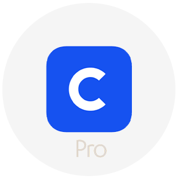

# Cryptocurrency Market Pairs Websocket

Originally built for Envato, but they rejected it due to third party dependency, so I thought just release it for free here.

**You can see a demo here: https://websocketdemo.superstack.io/cryptocurrency-market-pairs-websocket/**
## What is included?


```
project
│   readme.md
│   readme.pdf
│   index.html   
│   slim.html   
│   print-symbols.php   
│
└───assets
│   └───circle
│       │   binance.png
│       │   bitfinex.png
│       │   ...
│   └───css
│       │   bootstrap.css
│   └───js
│       │   bootstrap.js
│       │   jquery.min.js
│       │   numeral.js
│       │   popper.js
│       │   socket.io.js

```

## Introduction

The Cryptocurrency Market Pairs Websocket is a project built for those wishing to connect to a stable free-to-use websocket for crypto market data. We provide a means to connect to the executium websockets and display the data back.

This is the most cost effective way of pulling down market data to your website.

You have the full freedom with this package to examine and learn from it to ge tthe most out of market data that you can display on your website.

Are you looking for a crypto widget to display the bitcoin price in realtime from Bitfinex? Then this program can help provide you the means to get that result.

This packages provides:

- 8 Exchanges Implemented
- Ability to add dozens more
- 1000s of realtime symbols available 
- Bid Price, Ask Price, Bid Quantity, Ask Quantity
- Bitcoin, Ethereum, Monero, ADA, XRP, Tether just to name a few of the supported currencies
- Example on how to add more exchanges and even more symbols
- No need to build a large network of computers to support the 1000s of symbols
- Instantly plugin and get going
- Easy to customize design
- Built with jQuery, no troublesome backend setting up to do. A simple HTML file is all it takes

This market data is built on the ever so successful executium websocket network which is free for usage under fair use. You can learn more about that [here](https://github.com/executium/real-time-cryptocurrency-market-prices-websocket/blob/master/FAIR-USAGE.md).

This package has been priced and provided in a manner which allows you to use this as a starting block for your own website or application.

## What can I use this for?
We have spent time producing this project for users interested as a base point to build out their cryptocurrency website.

By using the free-to-use network provided by executium, you can enjoy a flawless delivery of crypto data to your users.

Now you have these files you can build on the foundation and implement even more information.

We do not know or provide the source code for pulling the crypto feeds, but we know that it is complicated and at this price point much better an idea to use free party providers of this data.

## Adding more exchanges
It is so easy! As part of the executium websocket public API, all you need to do is add a name to the menu. The menu exists as follows:

```html
<div class="dropdown-menu" aria-labelledby="dropdown01">
    <a class="dropdown-item" href="?exchange=binance">  Binance</a>
    <a class="dropdown-item" href="?exchange=bitfinex"> Bitfinex</a>
    <a class="dropdown-item" href="?exchange=bitmex"> Bitmex</a>
    <a class="dropdown-item" href="?exchange=coinbasepro"> Coinbase Pro</a>
    <a class="dropdown-item" href="?exchange=coinbase"> Coinbase</a>
    <a class="dropdown-item" href="?exchange=huobipro"> Huobi Pro</a>
    <a class="dropdown-item" href="?exchange=bittrex"> Bittrex</a>
    <a class="dropdown-item" href="?exchange=ftx"> FTX</a>
    <a class="dropdown-item" href="?exchange=gateio"> Gate.io</a>
</div>

```

You can find a full list of current supported symbols and exchanges here:

```
https://marketdata.executium.com/api/v2/system/symbols
```

You will find the script `print-symbols.php` which will render this for you in a neat way so that you can review the information. 

For example, you can add `bittrex` to your menu by simply adding

```html
<a class="dropdown-item" href="?exchange=bittrex">" class="imgcheck" style="width:30px;height:30px;" /> Bittrex</a>
```

## Showing all symbols
This isn't recommended to connect your device to all available websockets and symbols, as it could result in a IP ban. In this script we add a `rnd()` function which randomly shows. 

```javascript
if(rnd(1,20)==1 || i<5 || data.data.length<40)
```
This gives the ability to show 1 in every 20. You can adjust this as you see fit.

## How are we calling data?

We call data by using a `ajax()` query which provides us back data. This data then gives us the information related to symbols, which then goes on and connects to the websockets. 

As follows is a simple breakdown of how the process works:

```javascript
var exchange='bitfinex';
var url = 'https://marketdata.executium.com/api/v2/system/symbols';
$.ajax
({
    type: "POST",
    url: url,
    data: 'exchange=' + exchange,
    cache: false,
    crossDomain: true,
    xhrFields: {withCredentials: true},
    timeout: 6000,
    error: function (data) { setTimeout(function() { tableSymbols(exchange); },1500); },
    scriptCharset: "script", success: function (data) 
    {
        //
        $.each(data.data, function (i, v)
        {
            request_orderbook_server(exchange, v.id, 'bids');
            request_orderbook_server(exchange, v.id, 'asks');
        });
    }
});
    
```


## Orderbook Level
Executium supports 10 levels of the orderbook. You may have noticed the `-1` postfixed to a lot of the divs. This indicates that it wants `level1` of the orderbook. You can modify this to get different levels of the orderbook. You will need to make sure that you modify the code to indicate that you want that. Currently with this version we only support level 1 of the orderbook.

## API access
You do not need an API key to get started, and the emphasis is on the end users connection and how they interact with the executium servers.

## Speed
The speed of the websocket is fast. The speed of the actual orderbook feeds vary. I have observed roughly 500ms updates or lag at the longest point for an exchange such as binance, sometimes its ahead of the feed I am seeing at Binance. It really depends on your connection.

## Fair usage limits
There is fair usage limits applied to the feeds, and these can be further negioated with executium by subscription.

## Sync clock / why is the time negative? why is the time so far ahead?
You should look at the documentation provided [here](https://marketdata.executium.com/realtime-cryptocurrency-market-prices-websockets/) for more information about your local clock. Users sytems clock can get massively out of sync. Atomic clock sync is recommended for this method. As a rule you wouldn't really show this countdown to an end user as it has no value. We left it in for this as it could prove somewhat useful to advance your understanding.

### NOTICE
We are in noway affiliated with executium and cannot control the feed they provide. It should be noted that this is a service provided directly by them and we offer the means to connect to the websockets easily while showing how you can put a nice responsive design around it.
